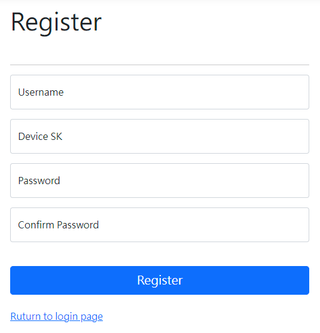
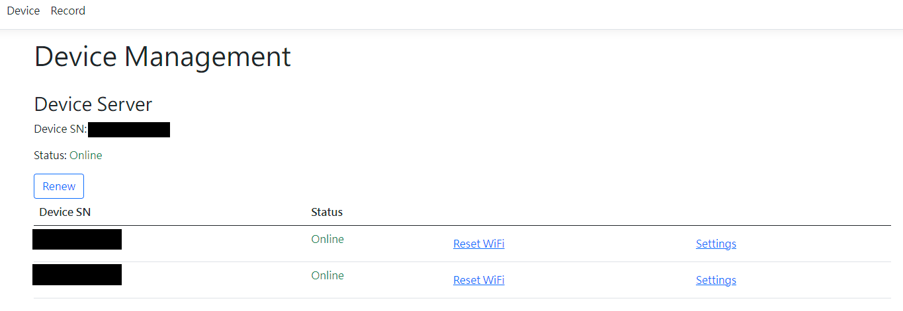
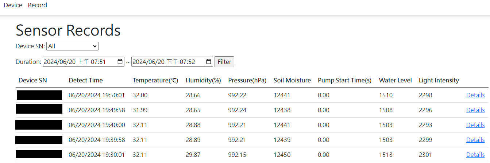

# Smart Water Pump System - Web UI
Automatic plant watering system website user interface.

This website provide a interface to control the following programs:
* [Smart Water Pump System - Arduino](https://github.com/AlbertYHsC/swps_edge.git)
* [Smart Water Pump System - IoT Server](https://github.com/AlbertYHsC/swps_device.git)

## Installation
1. Install `Apache2`, `MySQL` and `aspnetcore-runtime-8.0` on the IoT server device.
2. Use migrations to create database.
3. Publish this website application to a folder.
4. Copy the published folder to the IoT server device.
5. Please refer to `000-default.conf` and `swps-web.service` to setup website service.
6. Login your WiFi router to set a static ip address for this IoT server device.

## Dependencies
* [Identity.EntityFrameworkCore](https://www.nuget.org/packages/Microsoft.AspNetCore.Identity.EntityFrameworkCore/8.0.4)
* [Identity.UI](https://www.nuget.org/packages/Microsoft.AspNetCore.Identity.UI/8.0.4)
* [EntityFrameworkCore.Tools](https://www.nuget.org/packages/Microsoft.EntityFrameworkCore.Tools/8.0.4)
* [CodeGeneration.Design](https://www.nuget.org/packages/Microsoft.VisualStudio.Web.CodeGeneration.Design/8.0.2)
* [MySql.EntityFrameworkCore](https://www.nuget.org/packages/MySql.EntityFrameworkCore/8.0.0)

## User Guide
&#x2605; Due to the lack of encryption in the communication between the IoT server and the edge devices, 
it is recommended that this system be run on an intranet.

### Register User and Server Device
1. Open browser and enter `https://(your_iot_server_ip)/` to access this website.
2. Click `Register as a new user` to set up your account.
3. Enter user and server device information, then click `Register`.
    * The Device SK consists of 8 pairs of hexadecimal digits, separated by hyphens (`-`).
    * The first 4 pairs can be set arbitrarily, while the last 4 pairs correspond to the part after `SWPS` in the Device SN.
     Example: 
      > Device SN: SWPSA0B1C2D3 
      > Device SK: C4-D5-77-88-A0-B1-C2-D3
    * If you forget your password, you can use the Device SK to reset it.

    

### Manage Edge Device
Click `Device` on the navigation bar.

* Register New Device
  1. Connect the board to the IoT server using a USB cable.
  2. Wait for the device to start and watch the LED matrix.
  3. Click `Renew` when the LED matrix shows `LEDMATRIX_EMOJI_SAD` icon.
  4. Click `Register` at the right side of device.
  5. Set WiFi data and watering parameters, then click `Register`.
  6. Wait for the board restart and connect to WiFi.
  7. Remove USB cable from the IoT Server and power the board through an additional USB adapter.

* Reset WiFi Data on the Device
  1. Connect the board to the IoT server using a USB cable.
  2. Wait for the device to start and watch the LED matrix.
  3. Click `Renew` when the LED matrix shows `LEDMATRIX_EMOJI_SAD` (no WiFi) or nothing (normal).
  4. Click `Reset WiFi` at the right side of device.
  5. Set WiFi data and click `Reset WiFi`.
  6. Wait for the board restart and connect to WiFi.
  7. Remove USB cable from the IoT Server and power the board through an additional USB adapter.

* Change Watering Parameters of the Device
  1. Click `Renew`, then click `Settings` at the right side of device.
  2. Change watering parameters, then click `Update`.
  3. The board will receive new parameters upon the next detection time or restart.

### Search Sensor Data Records
Click `Record` on the navigation bar.

* Select a device from the drop-down list.
* Use the start time and end time filters to search for data.
* Clicking `Details` will show more information.

## System Architecture

